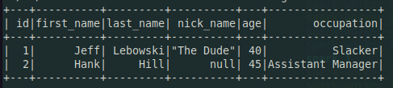

# Sample Dockerized Spark with JDBC to Dockerized Postgres

Features:

- Hot reload of Spark code
- Auto-initializing Postgres Database

Output from the included PySpark job `sample.py` under `spark/pyspark_code`:

## Running

Create a new `.env` file based on `.env.example` provided. Then, run `docker-compose up`. You should be able to enter the spark master using a command similar to

`docker exec -it spark-postgres-jdbc_spark_1 /bin/bash`

The output of `docker ps` will give you the specific container to connect to.

Then, your spark code can be found at `/opt/bitnami/spark/spark_user/pyspark_code`. You can submit a spark job by running the script at `/opt/bitnami/spark/spark_user/scripts/submit_job.sh /path/to/your/pyspark/code.py`.

Changes made to files under the `spark` directory in this repository will appear in `/opt/bitnami/spark/spark_user` inside of the master container, so you can develop your PySpark code in your IDE and run it in the container!

## Scaling

To add more spark workers, you can run `docker-compose up --scale spark-worker=n`, where n is the number of workers desired.

## Hacking

The postgres database is set up with a very basic table with some un-sensible default values. You can find its initialization script at `postgres/init.sql`. **When you make changes to this SQL script, you will need to run `docker-compose down --volumes` to reinitialize your postgres container. Otherwise, the initialization script won't be run again.**